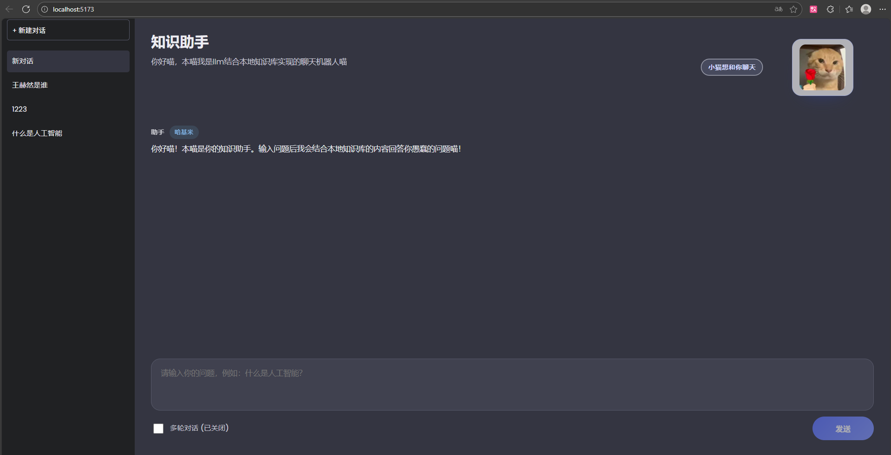

# 知识驱动喵系聊天机器人

一个用于练习的 React + TypeScript 前端项目，展示“本地知识库优先 + DeepSeek 兜底”的多轮对话流程，并加入了傲娇猫娘人格以及耄耋系列情绪插图。

## 界面展示



## 功能亮点

- **侧边栏历史记录**：支持新建、删除会话，自动保存聊天记录到本地（LocalStorage），刷新不丢失。
- **多轮对话开关（最多5轮）**：可一键开启真实多轮对话，维护最近 5 轮上下文（第 6 轮起滚动淘汰最早一轮）；关闭时为独立问答。
- **三级知识库 + 智能匹配**：`src/knowledgeBase.json` 采用“领域/子领域/问答”三级结构，并基于关键词权重 + 问题相似度综合匹配，优先返回本地答案。
- **后端安全代理 DeepSeek**：由 `server/server.js` 代理调用 DeepSeek，API Key 安全存放在 `server/.env`，前端不再暴露密钥。
- **情绪插画**：根据状态切换“耄耋送花/疑惑/行政/愤怒”插图。
- **防刷机制**：连续提问超过 5 次会触发“本喵也是要休息的！”提示。

## 快速开始

```bash
# 1. 安装前端依赖
npm install

# 2. 安装后端依赖
cd server
npm install
cd ..

# 3. 配置 API Key（重要！）
# 编辑 server/.env 文件，填入你的 DeepSeek API Key：
# DEEPSEEK_API_KEY=sk-your-api-key-here

# 4. 同时启动前后端（推荐）
npm run dev:all

# 或者分别启动：
# 终端 1：启动后端（端口 3000）
npm run dev:server

# 终端 2：启动前端（端口 5173）
npm run dev
```

访问 [http://localhost:5173](http://localhost:5173) 即可体验。

**注意**：

- API Key 现在存储在 `server/.env` 中，**不会暴露到浏览器**
- 前端通过 `http://localhost:3000` 调用后端代理接口
- 后端会代理请求到 DeepSeek API

## 项目结构

```text
Knowledge/
├─ server/                    # 后端代理服务器
│  ├─ server.js              # 简单的 Express 服务器
│  ├─ package.json           # 后端依赖
│  └─ .env                   # API Key 配置（重要！）
├─ image/                     # 耄耋表情图片
├─ src/
│  ├─ App.tsx                 # 主界面与业务逻辑
│  ├─ App.css                 # 样式（玻璃拟态 + 猫猫元素）
│  ├─ assets/index.ts         # 表情图片导出
│  ├─ hooks/                  # 自定义 Hooks
│  │  └─ useChatHistory.ts    # 聊天记录管理（LocalStorage）
│  ├─ knowledgeBase.json      # 三级分类知识库（领域/子领域/问答）
│  ├─ knowledgeSample.ts      # 空库时的占位样例
│  ├─ services/
│  │  ├─ deepseekService.ts   # 调用后端代理接口
│  │  └─ knowledgeService.ts  # 三级分类 + 关键词权重匹配
│  ├─ types.ts                # 类型定义
│  └─ main.tsx                # React 入口
├─ .env                       # 前端环境变量（后端地址）
├─ package.json               # 前端 NPM 配置
└─ README.md                  # 使用说明（当前文件）
```

## 自定义指南

- **补充知识库**：编辑 `src/knowledgeBase.json`，按“领域/子领域/问答”三级结构添加条目；为一级、二级分类配置 `keywords` 以提升匹配效果。
- **调整口癖**：修改 `src/App.tsx` 中的 `SYSTEM_PROMPT`。
- **替换插图**：将 `image/` 文件夹内同名图片替换为自己的素材。

祝你展示顺利，喵！
