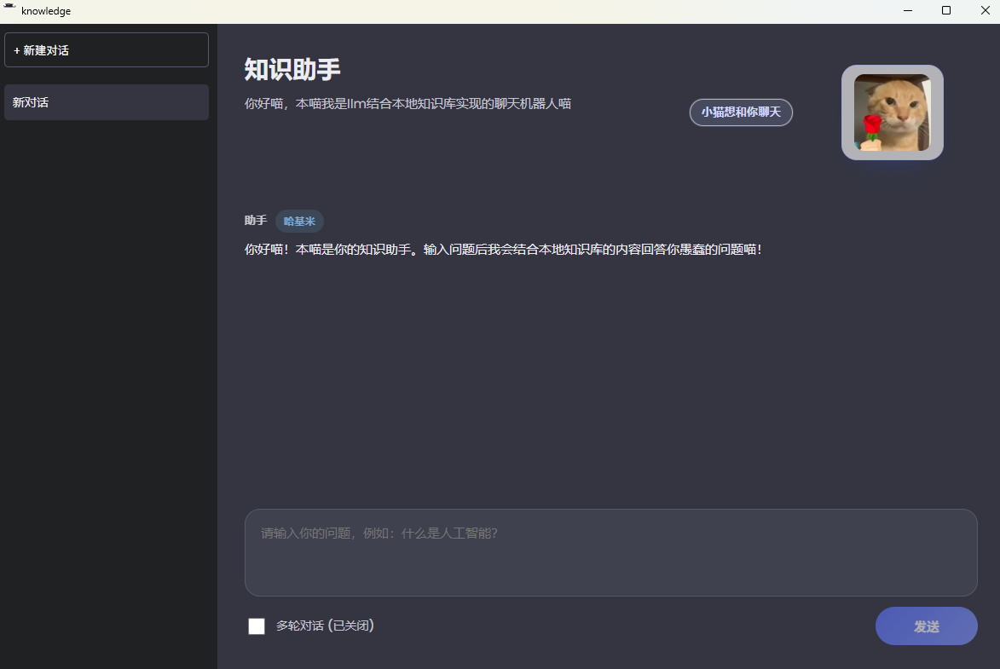

# 知识驱动喵系聊天机器人 (KnowledgeAssistant)

一个基于 **Electron + React + TypeScript** 构建的桌面端聊天机器人，展示“本地知识库优先 + DeepSeek 兜底”的多轮对话流程，并加入了傲娇猫娘人格以及耄耋系列情绪插图。支持 Windows 桌面客户端运行。

## 界面展示



## 功能亮点

- **侧边栏历史记录**：支持新建、删除会话，自动保存聊天记录到本地（LocalStorage），刷新不丢失。
- **多轮对话开关（最多5轮）**：可一键开启真实多轮对话，维护最近 5 轮上下文（第 6 轮起滚动淘汰最早一轮）；关闭时为独立问答。
- **三级知识库 + 智能匹配**：`src/knowledgeBase.json` 采用“领域/子领域/问答”三级结构，并基于关键词权重 + 问题相似度综合匹配，优先返回本地答案。
- **双模式运行**：支持 Web 浏览器模式（需启动后端服务）和 Electron 桌面客户端模式（内置 IPC 通信）。
- **后端安全代理 DeepSeek**：
  - **Web 模式**：由 `server/server.js` 代理调用 DeepSeek。
  - **Electron 模式**：通过 IPC 通信由主进程直接调用，API Key 安全存放在本地环境。
- **情绪插画**：根据状态切换“耄耋送花/疑惑/行政/愤怒”插图。
- **川剧机制**：连续提问超过 5 次会触发耄耋愤怒表情。
- **隐藏彩蛋**：试着问问“你的创造者是谁”，也许会有惊喜哦！

## 快速开始

### 1. 环境准备

```bash
# 安装项目依赖（根目录）
npm install

# 安装后端依赖（仅 Web 模式需要）
cd server
npm install
cd ..
```

### 2. 配置 API Key

在项目根目录创建 `.env` 文件（推荐），或在 `server/.env` 中配置：

```env
DEEPSEEK_API_KEY=sk-your-api-key-here
```

### 3. 运行项目

**桌面客户端模式（推荐）**

```bash
# 开发环境启动
npm run electron

# 打包构建 (Windows)
npm run electron:build
# 构建完成后，安装包位于 release_v1/ 目录下
```

**Web 浏览器模式**

```bash
# 同时启动前后端
npm run dev:all
```

**注意**：

- Electron 模式下，应用会优先读取根目录 `.env` 文件。
- Web 模式下，前端通过 `http://localhost:3000` 调用后端代理接口。

## 项目结构

```text
Knowledge/
├─ electron/                  # Electron 主进程与预加载脚本
│  ├─ main.cjs               # 主进程入口
│  └─ preload.cjs            # 预加载脚本 (IPC)
├─ release_v1/                # 打包输出目录
├─ server/                    # 后端代理服务器 (Web模式用)
│  ├─ server.js              # 简单的 Express 服务器
│  ├─ package.json           # 后端依赖
│  └─ .env                   # API Key 配置（备选）
├─ image/                     # 耄耋表情图片
├─ src/
│  ├─ assets/                 # 静态资源
│  │  └─ index.ts            # 资源导出
│  ├─ hooks/                  # 自定义 Hooks
│  │  └─ useChatHistory.ts    # 聊天记录管理
│  ├─ services/               # 业务服务
│  │  ├─ deepseekService.ts   # DeepSeek API 调用
│  │  └─ knowledgeService.ts  # 知识库匹配逻辑
│  ├─ App.css                 # 组件样式
│  ├─ App.tsx                 # 主应用组件
│  ├─ index.css               # 全局样式
│  ├─ knowledgeBase.json      # 本地知识库数据
│  ├─ knowledgeSample.ts      # 知识库占位数据
│  ├─ main.tsx                # 入口文件
│  └─ types.ts                # TypeScript 类型定义
├─ .env                       # 环境变量（API Key 推荐位置）
├─ package.json               # 前端 NPM 配置
└─ README.md                  # 使用说明（当前文件）
```

## 自定义指南

- **补充知识库**：编辑 `src/knowledgeBase.json`，按“领域/子领域/问答”三级结构添加条目；为一级、二级分类配置 `keywords` 以提升匹配效果。
- **调整口癖**：修改 `src/App.tsx` 中的 `SYSTEM_PROMPT`。
- **替换插图**：将 `image/` 文件夹内同名图片替换为自己的素材。

祝你展示顺利，喵！
