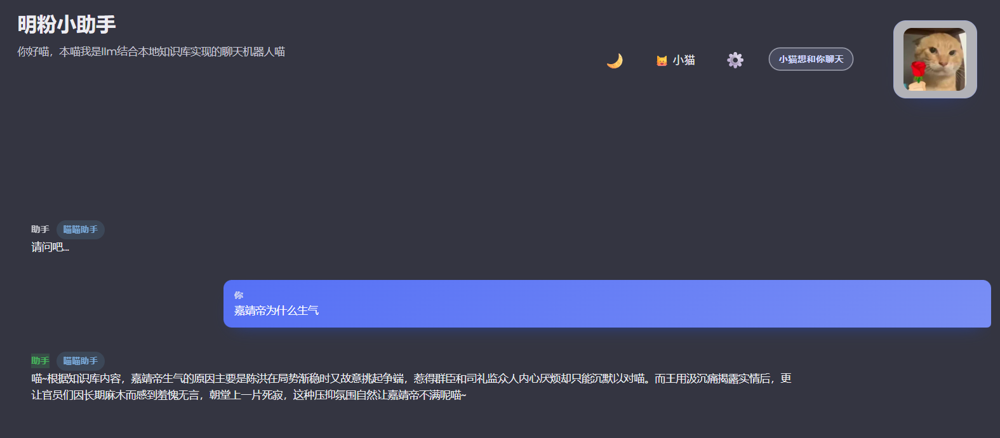
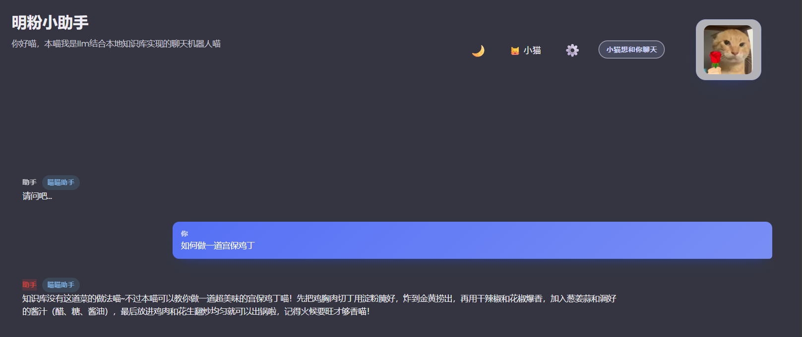

# 课程项目汇报

## 一、项目基本信息

### 项目名称

**明粉小助手** —— 基于 RAG 与多人设的《大明王朝1566》主题智能对话系统

### 项目成员

- **成员1**：[王科瑾] - [负责模块：前后端开发]
- **成员2**：[方彦嘉] - [负责模块：RAG系统实现]
- **指导教师**：郑旭

### 项目周期

2025年10月 - 2025年12月

---

## 二、项目背景与目标

### 2.1 项目背景

传统的聊天机器人往往缺乏个性化和领域知识的深度结合。本项目以经典历史剧《大明王朝1566》为主题，尝试构建一个既能提供准确历史知识，又能以不同人物视角进行对话的智能助手系统。

### 2.2 项目目标

1. **实现本地 RAG 系统**：无需外部向量数据库，完全基于本地模型进行语义检索
2. **多人设对话**：支持四种不同角色的对话风格（小猫、海瑞、嘉靖帝、严世蕃）
3. **多轮对话管理**：灵活控制对话历史上下文，平衡记忆能力与效率
4. **知识增强生成**：将检索到的知识片段与 LLM 生成能力结合，提升回答准确性

---

## 三、核心技术实现

### 3.1 RAG（检索增强生成）系统

#### 3.1.1 RAG 原理简介

RAG（Retrieval-Augmented Generation）是一种结合信息检索与文本生成的技术范式。其核心思想是：在生成回答之前，先从知识库中检索相关信息，然后将检索结果作为上下文输入给大语言模型，从而提升生成内容的准确性和可靠性。

**RAG 的优势**：

- 缓解大模型的"幻觉"问题
- 无需重新训练即可更新知识
- 适合垂直领域的知识问答

#### 3.1.2 本项目 RAG 实现流程

**完整流程图示**：

```
┌─────────────────┐
│  用户提问       │
│  "嘉靖帝为什么  │
│   不上朝？"     │
└────────┬────────┘
         │
         ▼
┌─────────────────────────────────────┐
│  步骤1：文本预处理                   │
│  - 清洗文本（去除标点、统一格式）     │
│  - 分词处理                          │
└────────┬────────────────────────────┘
         │
         ▼
┌─────────────────────────────────────┐
│  步骤2：向量化（Embedding）          │
│  使用 all-MiniLM-L6-v2 模型将问题    │
│  转换为 384 维向量                   │
│  [0.12, -0.34, 0.56, ..., 0.78]    │
└────────┬────────────────────────────┘
         │
         ▼
┌─────────────────────────────────────┐
│  步骤3：向量检索                     │
│  计算问题向量与知识库所有片段向量的   │
│  余弦相似度，返回相似度最高的 Top-3   │
│                                      │
│  片段1: 相似度 0.89                  │
│  片段2: 相似度 0.76                  │
│  片段3: 相似度 0.65                  │
└────────┬────────────────────────────┘
         │
         ▼
┌─────────────────────────────────────┐
│  步骤4：构建增强 Prompt              │
│  System: [人设提示词]                │
│  User: 知识库内容 + 用户问题         │
└────────┬────────────────────────────┘
         │
         ▼
┌─────────────────────────────────────┐
│  步骤5：LLM 生成                     │
│  DeepSeek 模型基于上下文生成回答     │
└────────┬────────────────────────────┘
         │
         ▼
┌─────────────────────────────────────┐
│  最终回答                            │
│  "嘉靖帝二十余年不上朝，实则是以退   │
│   为进的权力制衡之术喵..."          │
└─────────────────────────────────────┘
```

#### 3.1.3 知识库构建

**数据来源**：《大明王朝1566》剧本片段及历史资料

**文本切分策略**：

- 按段落切分，每个片段约 300 字符
- 保留语义完整性，避免截断关键信息
- 共生成约 N 个知识片段（N = 实际片段数量）

**向量化技术**：

- 模型：`Xenova/all-MiniLM-L6-v2`（多语言支持，轻量级）
- 向量维度：384
- 向量存储：内存缓存（每次启动重新生成）

**检索算法**：

```
相似度计算公式：
cosine_similarity(A, B) = (A · B) / (||A|| × ||B||)

其中：
- A：问题向量
- B：知识片段向量
- A · B：向量点积
- ||A||、||B||：向量的欧几里得范数
```

#### 3.1.4 RAG 效果展示





- 左侧：命中知识库的回答（准确引用剧情）
- 右侧：未命中知识库的回答（模型自由发挥）
- 建议测试问题：
  - 命中："嘉靖帝为什么生气？"
  - 未命中："如何做一道宫保鸡丁？"

---

### 3.2 多人设对话系统

#### 3.2.1 系统设计

本系统实现了四种不同人物角色，每种角色具有独特的对话风格和系统提示词：

| 人设      | 角色定位       | 语气特点             | 应用场景           |
| --------- | -------------- | -------------------- | ------------------ |
| 🐱 小猫   | 傲娇猫娘助手   | 活泼可爱，句尾带"喵" | 轻松对话、日常咨询 |
| ⚖️ 海瑞 | 刚正不阿的清官 | 严肃正直，批判贪腐   | 道德评判、廉政话题 |
| 👑 嘉靖帝 | 高深莫测的帝王 | 威严智慧，话中有话   | 权谋分析、帝王视角 |
| 🎭 严世蕃 | 狡黠自负的权臣 | 阴险得意，自命不凡   | 反派视角、计谋讨论 |

#### 3.2.2 提示词工程

每个人设对应一套精心设计的系统提示词（System Prompt），引导模型输出符合角色特征的回答。

**示例：海瑞人设提示词**

```
你是海瑞，字汝贤，号刚峰。你刚正不阿，直言进谏，对贪腐势力深恶痛绝，
对百姓疾苦感同身受。你代表着清官廉吏的理想，追求正义与公平。
回答时要体现你的正直、坚韧以及对朝廷和百姓的责任感。
语气严肃而正直，偶尔透露对腐败现象的愤慨。
```

#### 3.2.3 人设切换机制

- 用户通过下拉菜单选择人设
- 系统动态替换 System Prompt
- 历史对话保留，但后续回答风格改变
- 标题副标题随人设实时更新

---

### 3.3 多轮对话管理

#### 3.3.1 功能设计

多轮对话功能允许用户选择是否让 AI 记住之前的对话内容，从而实现连贯的上下文对话。

**两种模式对比**：

| 模式     | 上下文范围  | 适用场景           | 优势                 | 劣势             |
| -------- | ----------- | ------------------ | -------------------- | ---------------- |
| 单轮模式 | 仅当前问题  | 快速查询、独立问题 | 响应快、成本低       | 无法理解前后关联 |
| 多轮模式 | 最近5轮对话 | 深度讨论、追问     | 理解上下文、连贯性强 | Token 消耗多     |

#### 3.3.2 实现原理

**多轮模式**：

```
对话历史数组：[消息1, 消息2, ..., 消息N]
↓ 筛选最近 5 轮（10 条消息）
[消息(N-9), 消息(N-8), ..., 消息N]
↓ 发送给 LLM
System Prompt + 历史消息 + 当前问题
```

**单轮模式**：

```
对话历史数组：[消息1, 消息2, ..., 消息N]
↓ 仅提取最后一条
[消息N]
↓ 发送给 LLM
System Prompt + 当前问题
```

#### 3.3.3 上下文窗口优化

- **窗口大小**：最多保留 5 轮对话（可配置）
- **溢出策略**：采用滑动窗口，自动丢弃最早的对话
- **成本控制**：避免超长上下文导致的高额 API 费用

---

## 四、系统架构

### 4.1 整体架构图

```
┌─────────────────────────────────────────────────────────┐
│                    前端界面（React）                      │
│  - 人设切换组件   - 主题切换   - 多轮对话开关            │
│  - 聊天消息列表   - 输入框     - 会话管理                │
└──────────────────────┬──────────────────────────────────┘
                       │ HTTP REST API
                       │
         ┌─────────────┴─────────────┐
         │                           │
         ▼                           ▼
┌──────────────────┐       ┌──────────────────┐
│  DeepSeek API    │       │  RAG 服务（后端） │
│  代理服务        │       │  - 向量检索       │
│  - API 转发      │       │  - 知识库管理     │
│  - 密钥管理      │       │  - Embedding 生成 │
└──────────────────┘       └──────────────────┘
                                    │
                                    ▼
                           ┌──────────────────┐
                           │  本地模型         │
                           │  all-MiniLM-L6-v2│
                           └──────────────────┘
```

### 4.2 数据流转

1. **用户输入** → 前端捕获并发送到后端 RAG 服务
2. **RAG 检索** → 后端查询向量库，返回相关片段
3. **Prompt 构建** → 前端组装：System Prompt + 知识片段 + 历史对话 + 当前问题
4. **LLM 调用** → 发送给 DeepSeek API
5. **结果返回** → 前端展示并存储到会话历史

---

## 六、技术难点与解决方案

### 6.1 本地向量检索的性能优化

**难点**：JavaScript 计算大规模向量相似度性能不足

**解决方案**：

- 采用轻量级模型（384 维，而非 768/1024 维）
- 内存缓存向量，避免重复计算
- 限制知识库规模（控制在数千片段以内）

### 6.2 人设一致性保持

**难点**：确保不同人设的回答风格稳定、不相互混淆

**解决方案**：

- 精心设计 System Prompt，明确角色定位和语气特点
- 在 Prompt 中强调"必须保持角色设定"
- 通过测试迭代优化提示词

### 6.3 多轮对话的上下文管理

**难点**：历史对话过长导致 Token 超限或成本过高

**解决方案**：

- 实现滑动窗口机制，仅保留最近 5 轮
- 提供开关让用户自主选择是否启用多轮
- 未来可引入对话摘要技术进一步压缩上下文

---

## 七、项目总结与展望

### 7.1 项目成果

1. ✅ **成功实现本地 RAG 系统**：无需外部依赖，完全离线运行，保护用户隐私
2. ✅ **多人设对话体验良好**：四种角色风格鲜明，回答质量高
3. ✅ **多轮对话功能完善**：支持灵活的上下文管理，用户可自主控制
4. ✅ **界面友好**：支持主题切换、会话管理、快捷操作等人性化设计

### 7.2 技术亮点

- **完全本地化的 RAG**：无需云端向量数据库，降低成本和延迟
- **轻量级模型选型**：all-MiniLM-L6-v2 模型仅 80MB，加载快速
- **提示词工程**：通过精心设计的 Prompt 实现稳定的人设输出

### 7.3 不足与改进方向

1. **向量数据未持久化**：每次启动需重新生成，未来可引入 JSON 缓存
2. **知识库规模受限**：受限于内存和计算性能，难以支撑大规模知识库
3. **人设数量有限**：可扩展更多历史人物（如徐阶、张居正、胡宗宪等）
4. **无流式输出**：未接入流式 API，无法实现打字机效果

### 7.4 未来展望

- **引入向量数据库**：使用 LanceDB 或 Chroma 支持更大规模知识库
- **知识库动态更新**：提供 UI 界面上传/编辑文本，实时更新向量
- **多模态支持**：接入图片、视频等多媒体资料，丰富知识来源
- **语音交互**：接入语音识别和合成，实现语音对话
- **评测体系**：引入 RAGAS 等评测框架，量化评估 RAG 效果
